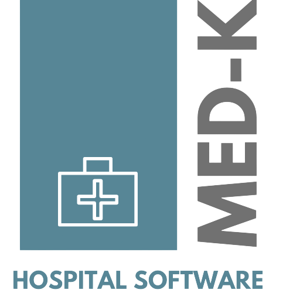

 

<h1 align="center">Med-K (Capstone Project)</h1>

# ✅ Descrição do Projeto

Aplicação web para centralização de dados do paciente e agendamento de consultas, exames e vacinas.
Realizado por alunos da Kenzie Academy Brasil em virtude da conclusão do módulo de desenvolvimento Front-End.

# ✅ Features

- [x] Cadastro de paciente
- [x] Cadastro de médico
- [x] Solicitações do paciente (consultas, exames e vacinas)
- [x] Histórico de consulta detalhado
- [x] Resultados de exames com feedback do médico
- [x] Carteira de vacinação digital
- [x] Visualização dos dados do paciente

# 🛠 Tecnologias

- [React](https://pt-br.reactjs.org/)
- [Redux](https://redux.js.org/)
- [Styled Components](https://styled-components.com/)
- [React Router Dom](https://reactrouter.com/web/guides/quick-start)
- [React Hook Form](https://react-hook-form.com/)
- [JWT Decode](https://jwt.io/)
- [Remask](https://github.com/brunobertolini/remask)
- [Yup](https://github.com/jquense/yup)
- [Framer Motion](https://www.framer.com/motion/)
- [Sweet Alert](https://sweetalert2.github.io/)

# ✅ Status do Projeto

<h3 align="center"> 
	🚧 Em construção... 🚧
</h3>

# 🖥️ Devs

- [Cirineu Rodrigues (Scrum Master)](https://www.linkedin.com/in/cirineurodrigues/)
- [Davi Andrade (Tech Leader)](https://www.linkedin.com/in/davi-andrade-2366661a7/)
- [João Carvalho (PO)](https://www.linkedin.com/in/joaomarcosc/)
- [Matheus Ferreira (QA)](https://www.linkedin.com/in/matheusrfferreira/)
- [Paulo Henrique (QA)](https://www.linkedin.com/in/paulo-henrique-0bb15b192/)
